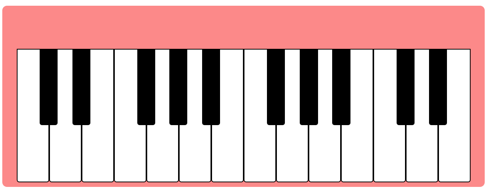

# javascript-piano
Piano written in JavaScript

# Image Example

# License
Please see [Apache 2.0 License](./LICENSE) for details.

# Citation
Kubów, A. (2022, August 17). <i>How to build a PLAYING Piano in JavaScript!</i> YouTube. Retrieved August 17, 2022, from https://www.youtube.com/watch?v=mjmh093Sucg
